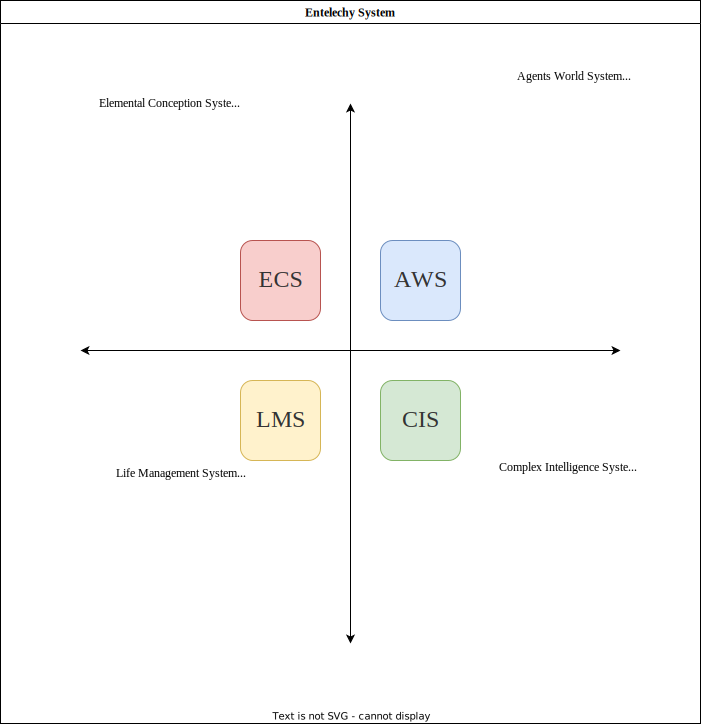
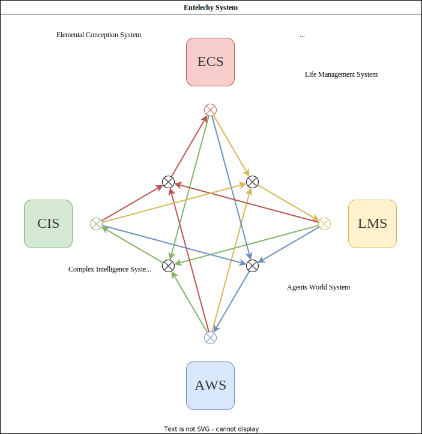

# EntelechySystem

# 版本

> [!info] 版本
> V0.2.1
>
> 该版本起于2022年06月07日，于岳麓山下桃子湖畔。至今仍在发展中。

# 简介

**生机系统**（Entelechy System，ES）。该系统是一个同时在宏观世界交互尺度、微观运作尺度、中观个体认知尺度互相交互的系统。

# 构成

生机系统由四大子系统构成:
- [复杂智能体系统（Complex Intelligence System, CIS）](https://github.com/EthanSystem/ComplexIntelligenceSystem.git)；
- [基本概念系统（Elemental Conception System，ECS）](https://github.com/EthanSystem/ElementalConceptionSystem.git)；
- [生命周期管理系统（Life Management System，LMS）](https://github.com/EthanSystem/LifeManagementSystem.git)；
- [多智能体世界系统（Agents World System，AWS）](https://github.com/EthanSystem/AgentsWorldSystem.git)；

## 生机系统之四分法

生机系统各子系统按照四分法法可以划分如下：静态的四象限与动态的四互动。

### 生机系统之四象限

生机系统之四象限通过两个维度，划分系统为四个象限，每个象限各对应一个子系统。

### 生机系统之四互动

生机系统之四互动按照子系统之互动方式如下。

