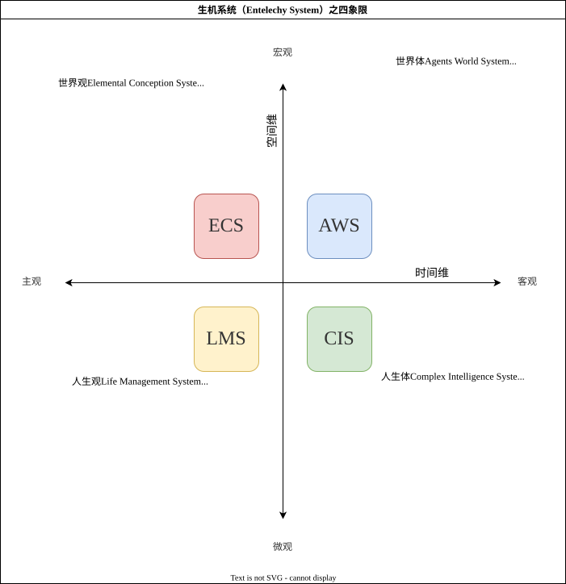
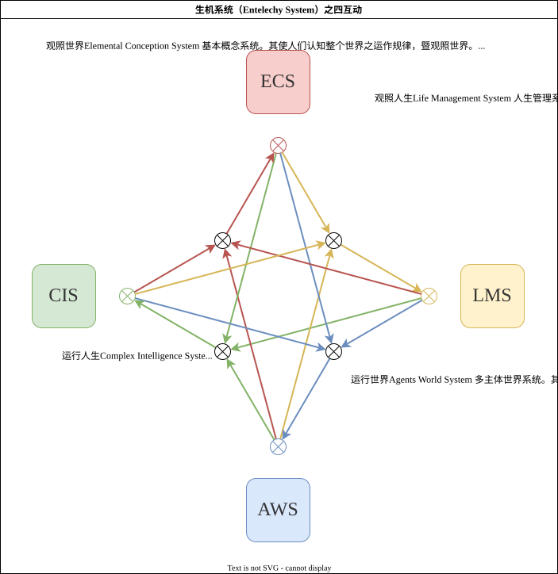

# EntelechySystem


# 版本

> [!info] 版本
> v0.0.8_alpha
>
> 该版本起于2022年06月07日，于岳麓山下桃子湖畔。至今仍在发展中。

# 简介

**生机系统**（Entelechy System，ES）。该系统是一个同时在宏观世界交互尺度、微观运作尺度、中观智能个体认知尺度互相交互的系统。总的来说，该系统是一个**通用人工智能**系统。


## 项目地址


相关笔记的仓库：

- [生机系统笔记](https://github.com/EntelechySystem/EntelechySystem_notebook.git)

相关的开发的仓库：

- [生机系统（Entelechy System，ES）](https://github.com/EntelechySystem/EntelechySystem)；

- [生机引擎（Entelechy Engine，EE）](https://github.com/EntelechySystem/EntelechyEngine);

> 后续考虑将生机引擎暂时并入升级系统。

# 使用方法

## 快速开始

1. 准备环境：Python 版本需要 `>=3.12`。

2. 安装依赖（Windows PowerShell）：

```powershell
python -m venv .venv
.\\.venv\\Scripts\\Activate.ps1
python -m pip install -U pip
pip install -r requirements.txt
```

3. 运行一个示例实验：

```powershell
python EntelechySystem_python\\Experiments\\EXP_test_010.py
```

该实验脚本会调用模拟器入口 `EntelechySystem_python/simulator.py` 中的 `simulator(config)`。

4. 修改配置：

示例实验默认读取配置目录：
- `EntelechySystem_python/Libraries/ConfigsLibrary/config_test`

仓库也提供工作区配置目录（常用于运行态配置）：
- `workstage/config/`

## 文档

- 文档索引：见 [docs/README.md](docs/README.md)
- 开发者指南：见 [docs/开发者指南.md](docs/开发者指南.md)
- 用户手册：见 [docs/用户手册.md](docs/用户手册.md)
- 开发日志：见 [docs/开发日志.md](docs/开发日志.md)
- 需求文档：见 [docs/需求文档.md](docs/需求文档.md)


# 构想篇


## 构成

生机系统（Entelechy System，ES）由四大子系统构成。

- 复杂智能体系统（Complex Intelligence System, CIS）；
- 基本概念系统（Elemental Conception System，ECS）；
- 生命周期管理系统（Life Management System，LMS）；
- 多智能体世界系统（Agents World System，AWS）；

## 生机系统之四分法

生机系统各子系统按照四分法法可以划分如下：静态的四象限与动态的四互动。

### 生机系统之四象限

生机系统之四象限通过两个维度，划分系统为四个象限，每个象限各对应一个子系统。




### 生机系统之四互动

生机系统之四互动按照子系统之互动方式如下。




# 相关资料

> [!reference：生机系统之子系统]
>
> - [[基本概念系统]]
> - [[档案：一类生命周期管理系统畅想]]
> - [[复杂多智能体思维认知机制运作系统]]


# 资源


### 示意图

![[总体分析框架.drawio]]

![[程序设计.drawio]]


# 灵感来源：

- 产生、整合、归纳、分析自己从过去以来至今的思考结果，继承自原有的三个项目：
  - Elemental Cognition System；
  - Life Management System；
  - Agents World System；
- 借鉴和吸收人类文明优秀的知识结晶、理论、模型、工具、框架、程序，包括且不限于：
  - 借鉴吸收现关于人工智能理论之思想和实现，包括深度学习（2022年附近）、强化学习（2022年附近）、因果推断（2022年附近）、图学习（2022年附近）、图形图像处理（2022年附近）、自然语言处理（2022年附近）、大语言模型（2023年附近）。
  - 现有许多关于数学和系统科学理论之思想，包括复杂网络（2018年之前）、最优控制（2018年之前）等、动力系统（2018年之前）、概率统计（2018年之前）等；
  - 借鉴吸收一些现有社会科学领域如：哲学领域、心理学领域、认知科学领域、语言学领域、马克思哲学思想、中国传统文化如易经等思想、侯世达之一些著作之思想、进化论思想等；
  - 借鉴一些现有应用科学领域如生理学、脑神经科学、机械工程学、系统工程学、复杂系统理论等领域知识；
  - NARS系统之一些思想（2021年附近）；
  - he4o系统之一些思想（2021年附近）；
  - 其它一些古老哲学思想；
- 借鉴和吸收各类论坛、交流群、学会的交流成果。特别鸣谢：
  - 集智俱乐部；
  - 中国通用人工智能协会官方QQ群；


